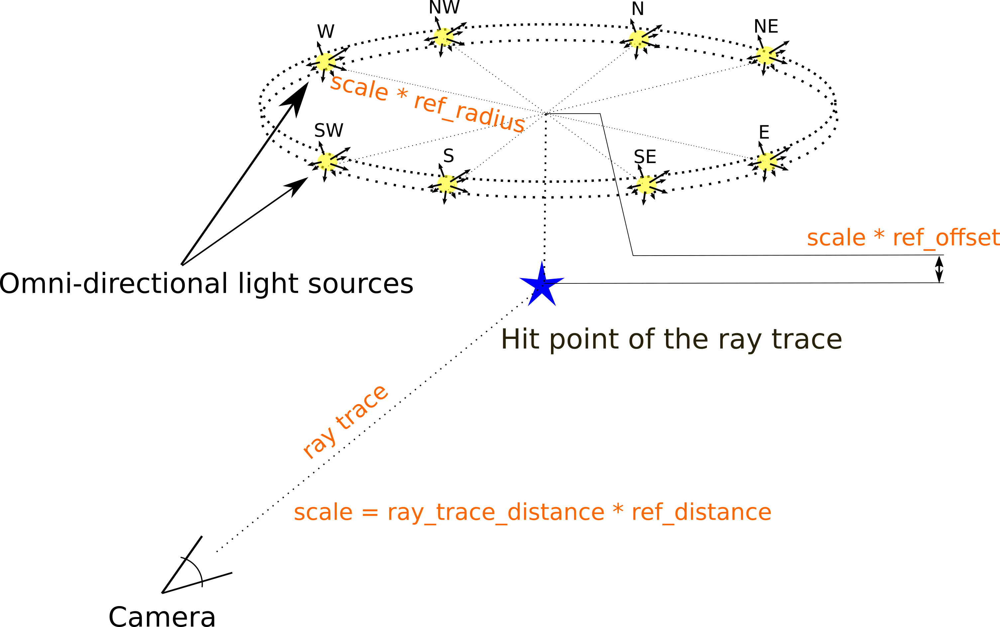
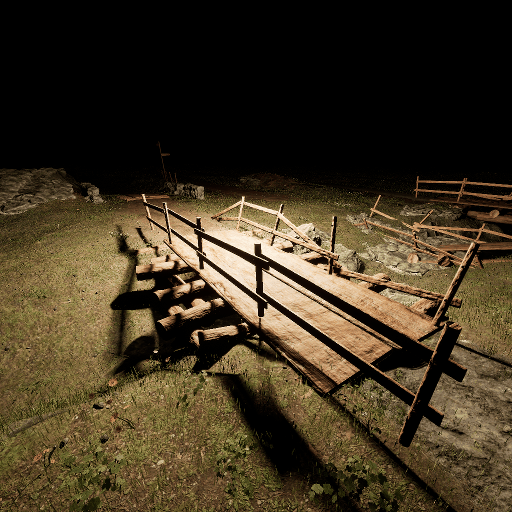
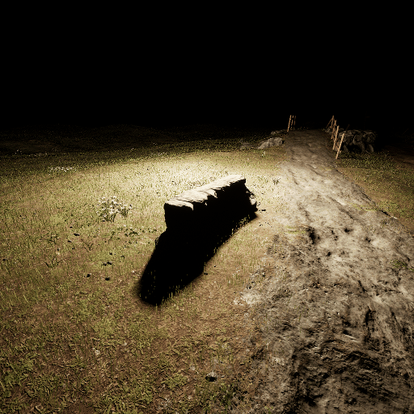
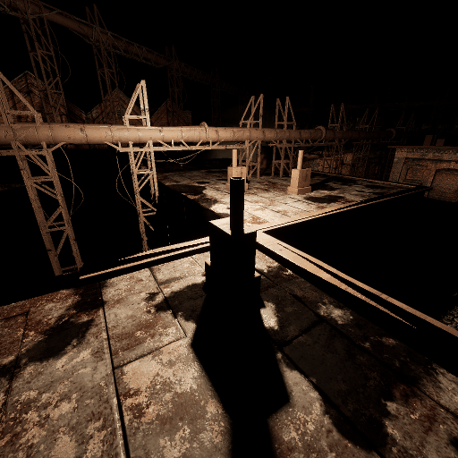
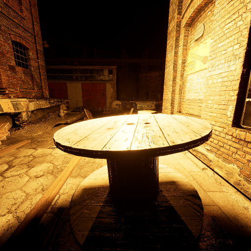
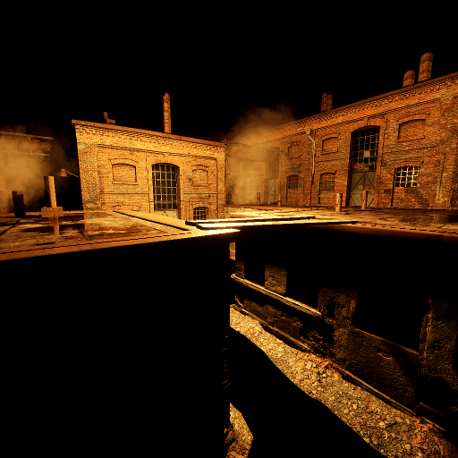

# VIDIT: Virtual Image Dataset for Illumination Transfer

We release updates on a rolling basis, you can watch the repo/follow the author to be notified! 

Contact author: [Majed El Helou](https://majedelhelou.github.io/)

:fire: **News-Jun21**: Our CVPR 2021 NTIRE workshop event will be available for everyone! Live [stream](https://data.vision.ee.ethz.ch/cvl/ntire21/#live), or [zoom](https://ethz.zoom.us/j/63989612192) to join on June 19 2021, starting 14:00 UTC (7:00 Pacific Standard Time). Full schedule [here](https://data.vision.ee.ethz.ch/cvl/ntire21/#schedule).

:fire: **News-Jan21**: VIDIT augmented with depth information is used in the NTIRE workshop challenges, part of CVPR 2021. The competition starts on January 5th 2021, and is made up of the depth guided [one-to-one](https://competitions.codalab.org/competitions/28030) and [any-to-any](https://competitions.codalab.org/competitions/28031) illumination transfer.

:fire: **News-May20**: VIDIT is used for the relighting challenge in the [AIM workshop](https://data.vision.ee.ethz.ch/cvl/aim20/), part of ECCV 2020. Check out the relighting competition beginning May 13th 2020, it is made up of 3 tracks for [one-to-one](https://competitions.codalab.org/competitions/24671) and [any-to-any](https://competitions.codalab.org/competitions/24674) illumination transfer, and for [illumination estimation](https://competitions.codalab.org/competitions/24773).

#### [[VIDIT Paper](https://arxiv.org/abs/2005.05460)] 
#### [[ECCV AIM 2020 Paper](https://arxiv.org/abs/2009.12798)] - [[Supp.](https://github.com/majedelhelou/VIDIT/blob/master/AIM_2020_Relighting_Supp.pdf)] - [[Video](https://www.youtube.com/watch?v=Zn7R0fbXJZw)]
#### [[CVPR NTIRE 2021 Paper](https://arxiv.org/abs/2104.13365)] - [[Video](https://youtu.be/TSpct2FGCBw)]

> **Abstract:** *Deep image relighting is gaining more interest lately, as it allows photo enhancement through illumination-specific retouching without human effort. Aside from aesthetic enhancement and photo montage, image relighting is valuable for domain adaptation, whether to augment datasets for training or to normalize input test data. Accurate relighting is, however, very challenging for various reasons, such as the difficulty in removing and recasting shadows and the modeling of different surfaces. We present a novel dataset, the Virtual Image Dataset for Illumination Transfer (VIDIT), in an effort to create a reference evaluation benchmark and to push forward the development of illumination manipulation methods. Virtual datasets are not only an important step towards achieving real-image performance but have also proven capable of improving training even when real datasets are possible to acquire and available. VIDIT contains 300 virtual scenes used for training, where every scene is captured 40 times in total: from 8 equally-spaced azimuthal angles, each lit with 5 different illuminants.*

## Content
VIDIT includes 390 different Unreal Engine scenes, each captured with 40 illumination settings, resulting in 15,600 images. The illumination settings are all the combinations of 5 color temperatures (2500K, 3500K, 4500K, 5500K and 6500K) and 8 light directions (N, NE, E, SE, S, SW, W, NW). Original image resolution is 1024x1024.

<p align="center">
  
</p>


## Getting the CVPR 2021 NTIRE data (with depth maps)
Note: *ground-truth test* data will remain private.

Track 1 is one-to-one relighting: transforming an image from its input illumination settings to the target illumination settings.

Track 2 is any-to-any relighting: unlike track 1, the input illumination is variable, and the target illumination is not fixed but is rather given by another guide image.

**Track 1**: [[Train](https://datasets.epfl.ch/vidit/NTIRE2021/track1_train.zip)] - [[Validation_Input](https://datasets.epfl.ch/vidit/NTIRE2021/track1_validation.zip)] - [[Validation_GT](https://datasets.epfl.ch/vidit/NTIRE2021/track1_validation_gt.zip)] - [[Test_Input](https://datasets.epfl.ch/vidit/NTIRE2021/track1_test.zip)]

**Track 2**: [[Train](https://datasets.epfl.ch/vidit/NTIRE2021/track2_train.zip)] - [[Validation_Input](https://datasets.epfl.ch/vidit/NTIRE2021/track2_validation.zip)] - [[Validation_GT](https://datasets.epfl.ch/vidit/NTIRE2021/track2_validation_gt.zip)] - [[Test_Input](https://datasets.epfl.ch/vidit/NTIRE2021/track2_test.zip)]


## Getting the ECCV 2020 AIM data
Note: *ground-truth test* data will remain private.

**Track 1** (1024x1024): [[Train](https://datasets.epfl.ch/vidit/AIM2020/AIM2020_track1_train.zip)] - [[Validation_Input](https://datasets.epfl.ch/vidit/AIM2020/AIM2020_track1_validation.zip)] - [[Validation_GT](https://datasets.epfl.ch/vidit/AIM2020/AIM2020_track1_validation_gt.zip)] - [[Test_Input](https://datasets.epfl.ch/vidit/AIM2020/AIM2020_track1_test.zip)]

**Track 2** (1024x1024): [[Train](https://datasets.epfl.ch/vidit/VIDIT_train.zip)] - [[Validation_Input](https://datasets.epfl.ch/vidit/AIM2020/AIM2020_track2_validation.zip)] - [[Validation_GT](https://datasets.epfl.ch/vidit/AIM2020/AIM2020_track2_validation_gt.zip)] - [[Test_Input](https://datasets.epfl.ch/vidit/AIM2020/AIM2020_track2_test.zip)]

**Track 3** (512x512): [[Train](https://datasets.epfl.ch/vidit/AIM2020/AIM2020_track3_train.zip)] - [[Validation_Input](https://datasets.epfl.ch/vidit/AIM2020/AIM2020_track3_validation.zip)] - [[Validation_GT](https://datasets.epfl.ch/vidit/AIM2020/AIM2020_track3_validation_gt.zip)] - [[Test_Input](https://datasets.epfl.ch/vidit/AIM2020/AIM2020_track3_test.zip)]

The images are downsampled by 2 for the competition track 3 to ease the computations:
`smallsize_img = cv2.resize(origin_img, (512, 512), interpolation=cv2.INTER_CUBIC)`

If you want to use VIDIT for other purposes, the training images are provided in full 1024x1024 resolution in the "Train" link of **Track 2** above. Also available for download from a Google Drive mirror here: [[Download](https://drive.google.com/open?id=1i_2lIXi-gXgIouDCYnfrdtY3wzTiH1E9)]


## Some associated solutions (pull request/email to add yours)

* (ICIP2021) DSRN: an Efficient Deep Network for Image Relighting (S. D. Das, N. A. Shah, S. Dutta, H. Kumar): [[Paper](https://arxiv.org/abs/2102.09242)]

* (CVPRW2021) Multi-scale Self-calibrated Network for Image Light Source Transfer. (Y. Wang, T. Lu, Y. Zhang, Y. Wu): [[Paper](https://openaccess.thecvf.com/content/CVPR2021W/NTIRE/papers/Wang_Multi-Scale_Self-Calibrated_Network_for_Image_Light_Source_Transfer_CVPRW_2021_paper.pdf)] - [[Code](https://github.com/mdswyz/MCN-light-source-transfer)]

* (CVPRW2021) Multi-modal Bifurcated Network for Depth Guided Image Relighting. (H. Yang, W. Chen, H. Luo, S. Kuo): [[Paper](https://openaccess.thecvf.com/content/CVPR2021W/NTIRE/papers/Yang_Multi-Modal_Bifurcated_Network_for_Depth_Guided_Image_Relighting_CVPRW_2021_paper.pdf)] - [[Code](https://github.com/weitingchen83/NTIRE2021-Depth-Guided-Image-Relighting-MBNet)]

* (CVPRW2021) S3Net: A Single Stream Structure for Depth Guided Image Relighting. (H. Yang, W. Chen, S. Kuo): [[Paper](https://openaccess.thecvf.com/content/CVPR2021W/NTIRE/papers/Yang_S3Net_A_Single_Stream_Structure_for_Depth_Guided_Image_Relighting_CVPRW_2021_paper.pdf)] - [[Code](https://github.com/dectrfov/NTIRE-2021-Depth-Guided-Image-Any-to-Any-relighting)]

* (CVPRW2021) Physically Inspired Dense Fusion Networks for Relighting. (A. Yazdani, T. Guo, V. Monga): [[Paper](https://arxiv.org/pdf/2105.02209.pdf)] - [[Code](https://github.com/yazdaniamir38/Depth-guided-Image-Relighting)]

* (Software tool) Deep Illuminator: Data augmentation through variable illumination synthesis (G. Chogovadze): [[Code](https://github.com/chogovadze/Deep-Illuminator)] 

* (NeurIPSW2020) MSR-Net: Multi-Scale Relighting Network for One-to-One Relighting (S. D. Das, N. A. Shah, S. Dutta): [[Paper](https://montrealrobotics.ca/diffcvgp/assets/papers/9.pdf)]

* (ECCVW2020) WDRN : A Wavelet Decomposed RelightNet forImage Relighting (D. Puthussery, Hrishikesh P.S., M. Kuriakose, Jiji C.V): [[Paper](https://doi.org/10.1007/978-3-030-67070-2_32)]

* Encoder-decoder latent space manipulation (A. Dherse, M. Everaert, J. Gwizdala): [[Paper](https://arxiv.org/pdf/2006.02333.pdf)] - [[Code](https://github.com/martin-ev/2DSceneRelighting)]

* Norm-Relighting-U-Net (M. Afifi, M. Brown): [[Code](https://github.com/mahmoudnafifi/image_relighting)]

* (ECCVW2020) Deep relighting networks for image light source manipulation (L. Wang, Z. Liu, C. Li, W. Siu, D. Lun): [[Paper](https://arxiv.org/abs/2008.08298)] - [[Code](https://github.com/WangLiwen1994/DeepRelight)]

* (ECCVW2020) An ensemble neural network for scene relighting with light classification (Dong, L., Jiang, Z., Li, C.)

* (ECCVW2020) SA-AE for any-to-any relighting (Hu, Z., Huang, X., Li, Y., Wang, Q.): [[Paper](https://doi.org/10.1007/978-3-030-67070-2_32)]


## Citations
```bibtex
@article{elhelou2020vidit,
    title   = {{VIDIT}: Virtual Image Dataset for Illumination Transfer},
    author  = {El Helou, Majed and Zhou, Ruofan and Barthas, Johan and S{\"u}sstrunk, Sabine},
    journal = {arXiv preprint arXiv:2005.05460},
    year    = {2020}
}

@inproceedings{elhelou2020aim,
    title     = {{AIM} 2020: Scene Relighting and Illumination Estimation Challenge},
    author    = {El Helou, Majed and Zhou, Ruofan and S{\"u}sstrunk, Sabine and Timofte, Radu and others},
    booktitle = {Proceedings of the European Conference on Computer Vision Workshops (ECCVW)},
    year      = {2020}
}

@inproceedings{elhelou2021ntire,
    title     = {{NTIRE} 2021 Depth Guided Image Relighting Challenge},
    author    = {El Helou, Majed and Zhou, Ruofan and S{\"u}sstrunk, Sabine and Timofte, Radu},
    booktitle = {Proceedings of the IEEE/CVF Conference on Computer Vision and Pattern Recognition Workshops (CVPRW)},
    pages     = {566--577},
    year      = {2021}
}
```


### Examples with varying direction
<p align="center">
 

 

</p>


### Examples with varying color temperature
<p align="center">
 

 

</p>
